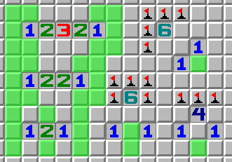

# minesweeper-pygame
A PyGame implementation of minesweeper. Forked from [eivankin's repository](https://github.com/eivankin/minesweeper-pygame) to borrow their Windows XP-like GUI. The underlying code has been modified to decouple game state from the game engine itself to enable seperate analysis, as well as making game feel more similar to what you'd find at [minesweeper.online](https://minesweeper.online/).
## Requirements
Python >=3.10 is required to run this application from source.
## Installation
```
git clone https://github.com/Origamijr/minesweeper-pygame
cd minesweeper-pygame
pip install -r requirements.txt
```
## Usage
```
python main.py
```
## TODO
- Clean code
- UI for analyzer
- Optimize solver
  - MSMs should be continuous, so there shouldn't be a need to regenerate them every board state
  - Counts for disjoint MSMs are unaffected by changes in the counts for the other. This can probably save some computation if a live DFS can be implemented
- Tips from [MS Coach](https://github.com/DavidNHill/JSMinesweeper/blob/master/README.md):
  - Dead tiles (tile that are either a mine or a specific number) need not be guessed until the end wince they provide no new information if clicked
  - Probability lines with the same number of mines can be combined? Need to think about this one more
  - Nonoverlaping regions that share a mine have the same probability. No need to compute them again
  - Look at the probability algorithm from [here](https://www.reddit.com/r/Minesweeper/comments/6oli70/new_probability_algorithm_info_in_comments/)
- Missing a rule that would encompass these patterns: 
  - Since solving minesweeper is coNP, maybe this means there's no finite amount of constant time rules such that can resolve all logical patterns. Need to investigate this, but it's probably the case unless P=NP or whatever